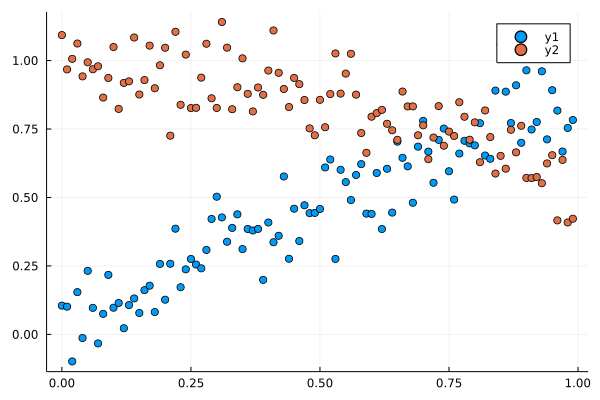

# Who am I ?


  * My name is *Pierre Navaro*
  * **Fortran 77 + PVM** : during my PhD 1998-2002 (Université du Havre)
  * **Fortran 90-2003 + OpenMP-MPI** : Engineer in Strasbourg (2003-2015) at IRMA
  * **Numpy + Cython, R + Rcpp** : Engineer in Rennes (2015-now) at IRMAR
  * **Julia v1.0** since July 2018


## Instructions to open the notebooks


https://github.com/cemracs2022/julia


---


# Why Julia?


  * Started in 2009 and first version was released in 2012.
  * High-level languages like Python and R let one explore and experiment rapidly, but can run slow.
  * Low-level languages like Fortran/C++ tend to take longer to develop, but run fast.
  * This is sometimes called the "two language problem" and is something the Julia developers set out to eliminate.
  * Julia's promise is to provide a "best of both worlds" experience for programmers who need to develop novel algorithms and bring them into production environments with minimal effort.


**Julia: A Fresh Approach to Numerical Computing**


*Jeff Bezanson, Alan Edelman, Stefan Karpinski, Viral B. Shah*


SIAM Rev., 59(1), 65–98. (34 pages) 2012


---


# First example


Implement your own numerical methods to solve


$$ y'(t) = 1 - y(t) $$ $$ t \in [0,5] $$ $$ y(0) = 0. $$


---


## Explicit Euler


```julia
euler(f, t, y, h) = t + h, y + h * f(t, y)
```


```
euler (generic function with 1 method)
```


## Runge-Kutta 2nd order


```julia
rk2(f, t, y, h) = begin
    ỹ = y + h / 2 * f(t, y)
    t + h, y + h * f(t + h / 2, ỹ)
end
```


```
rk2 (generic function with 1 method)
```


---


## Runge-Kutta 4th order


```julia
function rk4(f, t, y, dt)

    y₁ = dt * f(t, y)
    y₂ = dt * f(t + dt / 2, y + y₁ / 2)
    y₃ = dt * f(t + dt / 2, y + y₂ / 2)
    y₄ = dt * f(t + dt, y + y₃)

    t + dt, y + (y₁ + 2y₂ + 2y₃ + y₄) / 6

end
```


```
rk4 (generic function with 1 method)
```


---


## Solve function


```julia
function solve(f, method, t₀, y₀, h, nsteps)

    t = zeros(typeof(t₀), nsteps)
    y = zeros(typeof(y₀), nsteps)

    t[1] = t₀
    y[1] = y₀

    for i = 2:nsteps
        t[i], y[i] = method(f, t[i-1], y[i-1], h)
    end

    t, y

end
```


```
solve (generic function with 1 method)
```


---


## Plot solutions


```julia
using Plots

nsteps, tfinal = 10, 5.0
t₀, x₀ = 0.0, 0.0
dt = tfinal / (nsteps - 1)
f(t, x) = 1 - x

t, y_euler = solve(f, euler, t₀, x₀, dt, nsteps)

t, y_rk2 = solve(f, rk2, t₀, x₀, dt, nsteps)

t, y_rk4 = solve(f, rk4, t₀, x₀, dt, nsteps)
```


```
([0.0, 0.5555555555555556, 1.1111111111111112, 1.6666666666666667, 2.2222222222222223, 2.7777777777777777, 3.333333333333333, 3.8888888888888884, 4.444444444444444, 4.999999999999999], [0.0, 0.4258433673728598, 0.6703441612102632, 0.8107259136746093, 0.891327027951835, 0.9376046923112423, 0.9641753202456886, 0.979431022507319, 0.9881901851462188, 0.993219316471603])
```


---


```julia
plot(t, y_euler; marker = :o, label = "Euler")
plot!(t, y_rk2; marker = :d, label = "RK2")
plot!(t, y_rk4; marker = :p, label = "RK4")
plot!(t -> 1 - exp(-t); line = 3, label = "true solution", legend = :right)
```


---


```julia
using Measurements

t₀ = 0.0
x₀ = 0.0 ± 0.2

t, y_rk4 = solve(f, rk4, t₀, x₀, dt, nsteps)

plot(t, y_rk4; marker = :circle, label = "RK4", legend = :right)
```


---


## GPU Computing


https://github.com/JuliaGPU


```julia
using Plots, BenchmarkTools, FFTW, LinearAlgebra
```


### Advection equation for a rotation in two dimensional domain


$$
 \\frac{d f}{dt} +  (y \\frac{d f}{dx} - x \\frac{d f}{dy}) = 0
$$


$x \in [-π, π], y \in [-π, π]$ and  $t \in [0, 200π]$


---


# Composite type for mesh definition


```julia
struct Mesh

    nx   :: Int64
    ny   :: Int64
    x    :: Vector{Float64}
    y    :: Vector{Float64}
    kx   :: Vector{Float64}
    ky   :: Vector{Float64}

    function Mesh( xmin, xmax, nx, ymin, ymax, ny)
        # periodic boundary condition, we remove the end point.
        x = LinRange(xmin, xmax, nx+1)[1:end-1]
        y = LinRange(ymin, ymax, ny+1)[1:end-1]
        kx  = 2π ./ (xmax-xmin) .* [0:nx÷2-1;nx÷2-nx:-1]
        ky  = 2π ./ (ymax-ymin) .* [0:ny÷2-1;ny÷2-ny:-1]
        new( nx, ny, x, y, kx, ky)
    end
end
```


---


# Exact computation of solution


```julia
function exact!(f, time, mesh :: Mesh; shift=1.0)

    for (i, x) in enumerate(mesh.x), (j, y) in enumerate(mesh.y)

        xn = cos(time)*x - sin(time)*y - shift
        yn = sin(time)*x + cos(time)*y - shift

        f[i,j] = exp(-(xn^2+yn^2)/0.1)

    end

end
```


```
exact! (generic function with 1 method)
```


---


````julia
"""
    exact( time, mesh; shift=1.0)

Computes the solution of the rotation problem

```math
\\frac{d f}{dt} +  (y \\frac{d f}{dx} - x \\frac{d f}{dy}) = 0
```
"""
function exact( T, time, mesh :: Mesh; shift=1.0)

    f = zeros(T, (mesh.nx, mesh.ny))
    exact!(f, time, mesh, shift = shift)
    return f

end
````


```
Main.ex-index.exact
```


--


```julia
@doc exact
```

```
exact( time, mesh; shift=1.0)
```

Computes the solution of the rotation problem

$$
\frac{d f}{dt} +  (y \frac{d f}{dx} - x \frac{d f}{dy}) = 0
$$


---


# Create animation to show what we compute


```julia
using Plots

function animation( tf, nt)

    mesh = Mesh( -π, π, 64, -π, π, 64)
    dt = tf / nt
    t = 0
    f = zeros(Float64, (mesh.nx, mesh.ny))

    anim = @animate for n=1:nt

       exact!(f, t, mesh)
       t += dt
       p = contour(mesh.x, mesh.y, f, axis=[], framestyle=:none)
       plot!(p[1]; clims=(0.,1.), aspect_ratio=:equal, colorbar=false, show=false)
       plot!(√2 .* cos.(-π:0.1:π+0.1),
             √2 .* sin.(-π:0.1:π+0.1), label="", show=false)
       xlims!(-π,π)
       ylims!(-π,π)

    end

    anim

end
```


```
animation (generic function with 1 method)
```


---


```julia
anim = animation( 2π, 100)
gif(anim, "rotation2d.gif", fps = 20);
```


```
┌ Info: Saved animation to
└   fn = "/tmp/jl_xZqz3M/build/rotation2d.gif"
```


---


```julia
function rotation_on_cpu( mesh :: Mesh, nt :: Int64, tf :: Float64)

    dt = tf / nt

    f   = exact( ComplexF64, 0.0, mesh )

    exky = exp.( 1im*tan(dt/2) .* mesh.x  .* mesh.ky')
    ekxy = exp.(-1im*sin(dt)   .* mesh.y' .* mesh.kx )

    p_x, pinv_x = plan_fft!(f,  [1]), plan_ifft!(f, [1])
    p_y, pinv_y = plan_fft!(f,  [2]), plan_ifft!(f, [2])

    for n = 1:nt
        p_y * f
        f .*= exky
        pinv_y * f

        p_x * f
        f .*= ekxy
        pinv_x * f

        p_y * f
        f .*= exky
        pinv_y * f
    end

    real(f)

end
```


```
rotation_on_cpu (generic function with 1 method)
```


---


Run the simulation and test error.


```julia
mesh = Mesh( -π, π, 2048, -π, π, 1024)

nt, tf = 100, 20.

rotation_on_cpu(mesh, 1, 0.1) # trigger building

etime = @time norm( rotation_on_cpu(mesh, nt, tf) .- exact( Float64, tf, mesh))

println(etime)
```


```
 14.459870 seconds (439.17 k allocations: 166.505 MiB, 0.28% gc time, 1.45% compilation time)
6.155010684088094e-12
```


---


# Test if GPU packages are installed


```julia
using CUDA

GPU_ENABLED = CUDA.functional()

if GPU_ENABLED

    using CUDA.CUFFT

    println(CUDA.name(CuDevice(0)))

end
```


```
Tesla V100S-PCIE-32GB
```


**JuliaGPU** GPU Computing in Julia


https://juliagpu.org/


---


```julia
if GPU_ENABLED

    function rotation_on_gpu( mesh :: Mesh, nt :: Int64, tf :: Float64)

        dt  = tf / nt

        f   = CuArray(exact(ComplexF64, 0.0, mesh))

        exky = CuArray(exp.( 1im*tan(dt/2) .* mesh.x  .* mesh.ky'))
        ekxy = CuArray(exp.(-1im*sin(dt)   .* mesh.y' .* mesh.kx ))

        p_x, pinv_x = plan_fft!(f,  [1]), plan_ifft!(f, [1])
        p_y, pinv_y = plan_fft!(f,  [2]), plan_ifft!(f, [2])


        for n = 1:nt
            p_y * f
            f .*= exky
            pinv_y * f

            p_x * f
            f .*= ekxy
            pinv_x * f

            p_y * f
            f .*= exky
            pinv_y * f
        end

        real(collect(f)) # Transfer f from GPU to CPU

    end

end
```


```
rotation_on_gpu (generic function with 1 method)
```


---


```julia
if GPU_ENABLED

    nt, tf = 100, 20.

    rotation_on_gpu(mesh, 1, 0.1)

    etime = @time norm( rotation_on_gpu(mesh, nt, tf) .- exact(Float64,  tf, mesh))

    println(etime)

end
```


```
  0.492052 seconds (8.28 k allocations: 208.556 MiB, 3.55% gc time)
6.842308156967668e-12
```


---


# Time Series


```julia
struct TimeSeries{T,N}

   nt  :: Int
   nv  :: Int
   t   :: Vector{T}
   u   :: Vector{Array{T, 1}}

   function TimeSeries{T,N}( nt :: Int) where {T,N}

       t  = zeros(T, nt)
       u  = [zeros(T, N) for i in 1:nt]
       nv = N

       new( nt, nv, t, u)

   end

end
```


---


## Overload `Base.length` function


--


```julia
import Base:length

length(ts :: TimeSeries) = ts.nt

nt, nv = 100, 2
ts = TimeSeries{Float64, nv}(nt);

@show length(ts) == nt
```


```
true
```


Generate data


```julia
ts.t[1] = 0.0
ts.u[1] = [0.0, 1.0]

dt = 0.01
for i in 2:nt

   ts.t[i] = ts.t[i-1] + dt
   ts.u[i][1] = sin(ts.t[i])
   ts.u[i][2] = cos(ts.t[i])

end
```


---


```julia
using Plots

plot(ts.t, vcat(ts.u'...))
```


---


```julia
plot(ts.t, [getindex.(ts.u, i) for i in 1:nv])
```


---


## Overload the `[]` operator


we want `ts[i]` equal to `ts.u[:][i]` values


--


```julia
import Base: getindex
```


--


```julia
getindex( ts :: TimeSeries, i ) = getindex.(ts.u, i)
```


```
getindex (generic function with 385 methods)
```


---


```julia
plot(ts[1], ts[2])
```


---


## Overload the `+` operator to add noise


```julia
import Base:+
```


--


```julia
function +(ts :: TimeSeries, ϵ )

    for n in 1:ts.nt, d in 1:ts.nv
       ts.u[n][d] += ϵ[n,d]
    end
    return ts

end
```


```
+ (generic function with 318 methods)
```


---


```julia
ts = ts + 0.1*randn((nt,nv));
```


--


```julia
scatter(ts.t, [ts[1],ts[2]])
```





---


# Linear regression with obvious operation


```julia
using LinearAlgebra

X = hcat(ones(nt), ts.t, ts[1])
y = ts[2]

@show β = inv(X'X) * X'y
```


```
3-element Vector{Float64}:
  1.0798191295837176
 -0.3542373296335194
 -0.09944123963055414
```


---


# Version with QR factorisation


```julia
@show β = X \ y
```


```
3-element Vector{Float64}:
  1.0798191295837174
 -0.3542373296335036
 -0.09944123963056396
```


The `\` operator is the short-hand for


```julia
Q, R = qr(X)

@show β = (inv(R) * Q') * y
```


```
3-element Vector{Float64}:
  1.0798191295837176
 -0.3542373296335034
 -0.09944123963056428
```


---


# Version with singular values decomposition


```julia
U, S, V = svd(X)

@show β = V * Diagonal(1 ./ S) * U' * y
```


```
3-element Vector{Float64}:
  1.0798191295837176
 -0.35423732963350346
 -0.09944123963056493
```


--


```julia
@show β = pinv(X, atol=1e-6) * y
```


```
3-element Vector{Float64}:
  1.079819129583718
 -0.35423732963350363
 -0.09944123963056438
```


---


## With GLM.jl


```julia
using GLM

fitted = lm(X, y)
```


```
GLM.LinearModel{GLM.LmResp{Vector{Float64}}, GLM.DensePredChol{Float64, LinearAlgebra.CholeskyPivoted{Float64, Matrix{Float64}}}}:

Coefficients:
──────────────────────────────────────────────────────────────────
         Coef.  Std. Error      t  Pr(>|t|)  Lower 95%   Upper 95%
──────────────────────────────────────────────────────────────────
x1   1.07982     0.0186634  57.86    <1e-76   1.04278    1.11686
x2  -0.354237    0.0869095  -4.08    <1e-04  -0.526729  -0.181746
x3  -0.0994412   0.0910654  -1.09    0.2775  -0.280181   0.0812984
──────────────────────────────────────────────────────────────────

```


---


# Metaprogramming


## The ParticleGroup example


```julia
"""
    ParticleGroup{D,V}(n_particles, charge, mass)

 - `D` : number of dimension in physical space
 - `V` : number of dimension in phase space
 - `n` : number of particles
"""
struct ParticleGroup{D,V}

    n_particles       :: Int64
    data              :: Array{Float64, 2}

    function ParticleGroup{D,V}(n) where {D, V}

        data = zeros( Float64, (D+V, n))
        new( n, data)
    end

end
```


```
Main.ex-index.ParticleGroup
```


---


Set position of ith particle of p to x


```julia
@generated function set_x!( p :: ParticleGroup{D,V}, i,
                            x :: Float64 ) where {D, V}

    :(p.data[1, i] = x)

end
```


```
set_x! (generic function with 1 method)
```


--


Set position of ith particle of p to x when x is a vector


```julia
@generated function set_x!( p :: ParticleGroup{D,V}, i,
                            x :: Vector{Float64} ) where {D, V}

     :(for j in 1:$D p.data[j, i] = x[j] end)

end
```


```
set_x! (generic function with 2 methods)
```


---


Set velocity of ith particle of p to v


```julia
@generated function set_v!( p :: ParticleGroup{D,V}, i,
                            v :: Float64 ) where {D, V}

    :(p.data[$D+1, i] = v)

end
```


```
set_v! (generic function with 1 method)
```


--


Set velocity of ith particle of p to v


```julia
@generated function set_v!( p :: ParticleGroup{D,V}, i,
                            v :: Vector{Float64} ) where {D, V}

    :(for j in 1:$V p.data[$D+j, i] = v[j] end)

end
```


```
set_v! (generic function with 2 methods)
```


---


Get position of ith particle of p


```julia
@generated function get_x( p :: ParticleGroup{D,V}, i ) where {D, V}

     :(p.data[1:$D, i])

end
```


```
get_x (generic function with 1 method)
```


Get velocity of ith particle of p


```julia
@generated function get_v( p :: ParticleGroup{D,V}, i ) where {D, V}

     :(p.data[$D+1:$D+$V, i])
end
```


```
get_v (generic function with 1 method)
```


---


```julia
import Sobol
```


f(x,v) = 1/2π (1 + α cos (kx * x) * exp(-(vx²+vy²))


```julia
function landau_sampling!( pg :: ParticleGroup{1,2}, alpha, kx )

    function newton(r)
        x0, x1 = 0.0, 1.0
        r *= 2π / kx
        while (abs(x1-x0) > 1e-12)
            p = x0 + alpha * sin( kx * x0) / kx
            f = 1 + alpha * cos( kx * x0)
            x0, x1 = x1, x0 - (p - r) / f
        end
        x1
    end

    s = Sobol.SobolSeq(2)
    nbpart = pg.n_particles

    for i=1:nbpart
        v = sqrt(-2 * log( (i-0.5)/nbpart))
        r1, r2 = Sobol.next!(s)
        θ = r1 * 2π
        set_x!(pg,  i, newton(r2))
        set_v!(pg,  i, [v * cos(θ), v * sin(θ)])
    end

end
```


```
landau_sampling! (generic function with 1 method)
```


---


```julia
n_particles = 10000
pg = ParticleGroup{1,2}( n_particles)
alpha, kx = 0.1, 0.5
landau_sampling!(pg, alpha, kx)
```


--


```julia
xp = vcat([get_x(pg, i) for i in 1:pg.n_particles]...)
vp = vcat([get_v(pg, i) for i in 1:pg.n_particles]'...)
```


```
10000×2 Matrix{Float64}:
 -4.4505        5.45029e-16
 -7.70866e-16  -4.1964
  2.4939e-16    4.07285
 -2.82092       2.82092
  2.77602      -2.77602
 -2.73963      -2.73963
  2.70897       2.70897
  1.45172       3.50477
 -1.43904      -3.47415
  3.44671      -1.42768
  ⋮            
  0.0146796     0.0385387
 -0.0137887    -0.0361999
  0.0336995    -0.0128363
 -0.0309982     0.0118074
 -0.0122742     0.0273778
  0.0108246    -0.0241444
 -0.0204052    -0.0091482
  0.0158054     0.00708599
  0.00815159    0.00579259
```


---


```julia
using Plots

pp = plot(layout=(3,1))
histogram!(pp[1,1], xp, normalize=true, bins = 100, lab="x")
plot!(pp[1,1], x -> (1+alpha*cos(kx*x))/(2π/kx), 0., 2π/kx, lab="")
histogram!(pp[2,1], vp[:,1], normalize=true, bins = 100, lab="vx")
plot!(pp[2,1], v -> exp( - v^2 / 2) * 4 / π^2 , -6, 6, lab="")
histogram!(pp[3,1], vp[:,2], normalize=true, bins = 100, lab="vy")
plot!(pp[3,1], v -> exp( - v^2 / 2) * 4 / π^2 , -6, 6, lab="")
```


---


```julia
histogram2d(vp[:,1], vp[:,2], normalize=true, bins=100)
```


---


### Optimizing Julia code is often done at the expense of transparency


```julia
using Random, LinearAlgebra, BenchmarkTools

A = rand(1024, 256); B = rand(256, 1024); C = rand(1024, 1024)

function test1(A, B, C)
    C = C - A * B
    return C
end

@btime test1($A, $B, $C); #C, A and B are matrices.
```


```
  3.092 ms (4 allocations: 16.00 MiB)
```


--


```julia
function test2(A, B, C)
    C .-= A * B
    return C
end

@btime test2($A, $B, $C); #C, A and B are matrices.
```


```
  2.413 ms (2 allocations: 8.00 MiB)
```


---


```julia
function test_opt(A, B, C)
    BLAS.gemm!('N','N', -1., A, B, 1., C)
    return C
end
@btime test_opt($A, $B, $C) # avoids taking two unnecessary copies of the matrix C.
```


```
  979.645 μs (0 allocations: 0 bytes)
```


--


```julia
C = rand(1024, 1024)
all(test1(A, B, C) .== test2(A, B, C))
```


```
true
```


--


```julia
C = rand(1024, 1024)
all(test1(A, B, C) .== test_opt(A, B, C))
```


```
true
```


---


### Derivative computation with FFT


```julia
using FFTW

xmin, xmax, nx = 0, 4π, 1024
ymin, ymax, ny = 0, 4π, 1024

x = LinRange(xmin, xmax, nx+1)[1:end-1]
y = LinRange(ymin, ymax, ny+1)[1:end-1]

ky  = 2π ./ (ymax-ymin) .* [0:ny÷2-1;ny÷2-ny:-1]
exky = exp.( 1im .* ky' .* x)

function du_dy( u, exky )
    ifft(exky .* fft(u, 2), 2)
end

u = sin.(x) .* cos.(y') # 2d array created by broadcasting

@btime du_dy($u, $exky)
```


```
  53.534 ms (55 allocations: 64.00 MiB)
```


---


### Memory alignement, and inplace computation.


```julia
u  = zeros(ComplexF64, (nx,ny))
uᵗ = zeros(ComplexF64, reverse(size(u)))
ûᵗ = zeros(ComplexF64, reverse(size(u)))

u .= sin.(x) .* cos.(y')

fft_plan = plan_fft(uᵗ, 1, flags=FFTW.PATIENT)

function du_dy!( u, uᵗ, ûᵗ, exky )
    transpose!(uᵗ,u)
    mul!(ûᵗ,  fft_plan, uᵗ)
    ûᵗ .= ûᵗ .* exky
    ldiv!(uᵗ, fft_plan, ûᵗ)
    transpose!(u, uᵗ)
end

@btime du_dy!($u, $uᵗ, $ûᵗ, $exky )
```


```
  22.212 ms (2 allocations: 96 bytes)
```


---


# Why use Julia language!


  * **You develop in the same language in which you optimize.**
  * Packaging system is very efficient (7400 registered packages)
  * PyPi (390,111 projects) R (18407 packages)
  * It is very easy to create a package (easier than R and Python)
  * It is very easy to use GPU device and soon M1 (see Metal.jl).
  * Nice interface for Linear Algebra and Differential Equations
  * Easy access to BLAS and LAPACK
  * Julia talks to all major Languages - mostly without overhead!


---


# What's bad


  * It is still hard to build shared library or executable from Julia code.
  * Lattency when you import some packages. You must stay in the REPL.
  * Plotting takes time (10 seconds for the first plot)
  * OpenMP is better than the Julia multithreading library but it is progressing.
  * With vectorized code, you need to do a lot of inplace computation to avoid memory allocations and use explicit views to avoid copy.
  * Julia website proclaims that it is faster than C/Fortran but you must read carefully the [performance tips](https://docs.julialang.org/en/v1/manual/performance-tips/) before.
  * Julia package registry is highly GitHub-dependent.


---


## Python-Julia benchmarks by Thierry Dumont


https://github.com/Thierry-Dumont/BenchmarksPythonJuliaAndCo/wiki


# Julia is a language made for Science.


  * JuliaDiffEq – Differential equation solving and analysis.
  * JuliaDiff – Differentiation tools.
  * JuliaGeometry – Computational Geometry.
  * JuliaGraphs – Graph Theory and Implementation.
  * JuliaIntervals - Rigorous numerics with interval arithmetic & applications.
  * JuliaMath – Mathematics made easy in Julia.
  * JuliaOpt – Optimization.
  * JuliaPolyhedra – Polyhedral computation.
  * JuliaSparse – Sparse matrix solvers.
  * JuliaStats – Statistics and Machine Learning.
  * JuliaPlots - powerful convenience for visualization.
  * JuliaGPU - GPU Computing for Julia.
  * FluxML - The Elegant Machine Learning Stack.


---


*This page was generated using [Literate.jl](https://github.com/fredrikekre/Literate.jl).*

